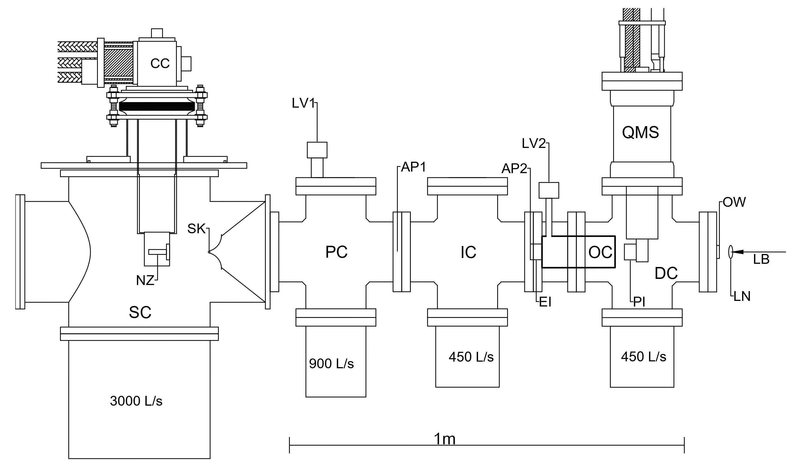

# CSCI596_FinalProject
USC CSCI596 Scientific Computing and Visualization Course Final Project.  

# Introduction
Modelling and visualizing of doped helium nanodroplets and calculation of molecular interaction between study molecule and helium nanodroplet.

The helium droplet acts as a superfluid, this allows the doped molecule to be isolated and trapped. The molecule can then be trapped in intermediate energy states, this then allows certain structures to be captured and studied.  

 

The above diagram is the entire system used to generate the droplets and study the molecule. 
The molecule is studied by using an infrared laser. When the droplet containing the captured molecule is indent on with the laser at a particular frequency, the molecule resonates and the droplet is evaporated. The free molecule now is ionised and then detected. 
 
Objectives of this project is to calculate the molecular interactions between the dopant and the droplet and visualize the movement of droplet through the system.

# Output

Modeled a system to depict droplet lifecycle from formation to detection.

